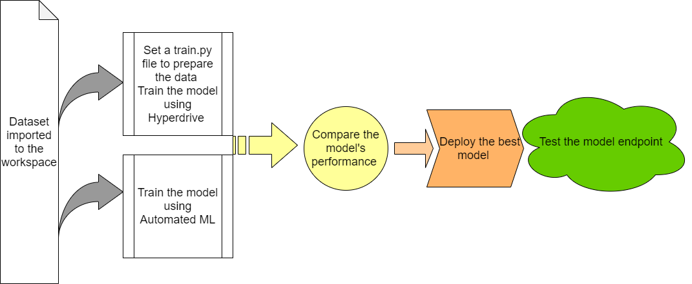
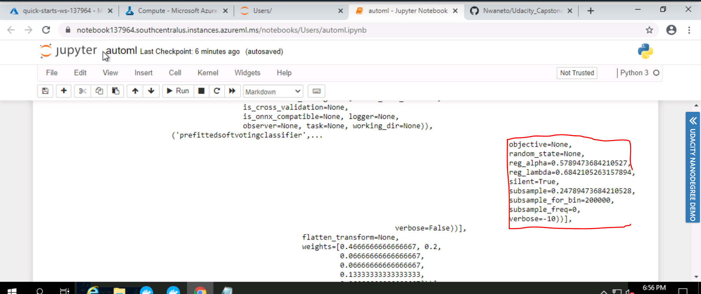
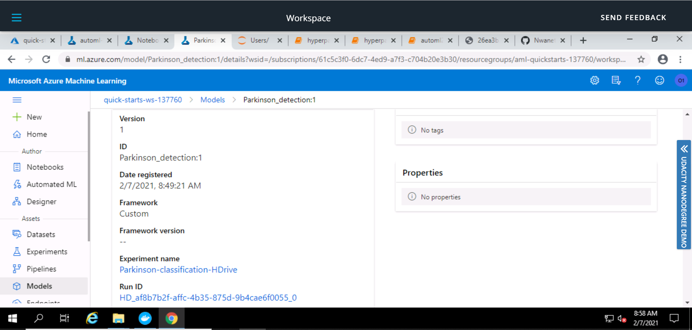

# Udacity ML Engineer with Microsoft Azure Nanodegree Capstone Project!

## Detecting Parkinson's Disease using Azure ML.  

### Project overview
Parkinson is a disease of the mind that prompts shaking, firmness, and trouble with strolling, equilibrium, coordination, and talking it might likewise bring about mental and social changes, rest problems,... (It is critical to make a careful determination as quickly as time permits). A few problems can cause indications like those of Parkinson's infection and there are likewise various approaches to do the finding (clinical test, reaction to sedate treatment,..) and so on 

This lead to the fundamental objective of this venture which is an endeavor to make a classifier to anticipate if an individual has Parkinson infection dependent on biomedical voice estimations from various individuals.

In this project, we started by training two models: one utilizing Automated ML and one redid model whose hyperparameters are tuned utilizing HyperDrive. At this point compared the performance level of the two models and finally deployed the best performing model.

## Dataset

### Dataset Overview
The dataset was created by Max Little of the University of Oxford, in collaboration with the National Centre for Voice and Speech, Denver, Colorado, who recorded the speech signals. The original study published the feature extraction methods for general voice disorders.

This dataset is composed of a range of biomedical voice measurements from 31 people, 23 with Parkinson's disease (PD). Each column in the table is a particular voice measure, and each row corresponds one of 195 voice recording from these individuals ("name" column). The main aim of the data is to discriminate healthy people from those with PD, according to "status" column which is set to 0 for healthy and 1 for PD.

The data is in ASCII CSV format. The rows of the CSV file contain an instance corresponding to one voice recording. There are around six recordings per patient, the name of the patient is identified in the first column.For further information or to pass on comments, please contact Max Little (littlem '@' robots.ox.ac.uk).

Further details are contained in the following reference -- if you use this dataset, please cite:
Max A. Little, Patrick E. McSharry, Eric J. Hunter, Lorraine O. Ramig (2008), 'Suitability of dysphonia measurements for telemonitoring of Parkinson's disease', IEEE Transactions on Biomedical Engineering (to appear).

### Datasource

Dataset used in the project: https://archive.ics.uci.edu/ml/datasets/parkinsons

### Task
The primary objective of this errand is to separate solid individuals from those with Parkinson's disease(PD), as indicated by the "status" section which is set to 0 for sound and 1 for PD to do this we utilized distinctive voice measure segments remembered for the dataset.

### Access
# An overview of the method used to get the data into Azure ML Studio workspace.
The data set can be accessed using the TabularDatasetFactory class having the from_delimited_files method which takes the file path as an argument and imports the file appropriately. Sample code snippet can be found below:

"path_url = 'https://gist.githubusercontent.com/Nwaneto/0d1477bd10c92f8b16ab19306d21a17f/raw/0af3078c0d174e26039ab31525487ceaceda77b0/parkinson-classification-data.csv'\n",
"ds = TabularDatasetFactory.from_delimited_files(path = path_url)
"ds.to_pandas_dataframe().head()"

## Automated ML
To configure the Automated ML run we used the setting described below:

|Settings |Reasons|
|-|-|
|**experiment_timeout_minutes**|Maximum time required in minutes that all iterations combined can take before the experiment terminates |
|**max_concurrent_iterations**|This manages the runs in parallel mode, we create a dedicated cluster per experiment, i.e. setting (4) to the number of nodes in the cluster(5-1))|
|**n_cross_validations**|Number of cross-validation ( to avoid overfitting) |
|**primary_metric**|This optimizes the accuracy |
|**task**|Classification |
|**compute_target**|To define the compute cluster  |
|**training_data**|Used for the training dataset stored in the datastore  |
|**label_column_name**|To specify the dependent variable to be classified |

### Results

Prior to running, AutoML Start first by examining over the info information to guarantee top notch is being utilized to prepare the model where he utilizes class adjusting discovery, Missing Feature esteems ascription, and high cardinality highlight recognition. 

After the execution, the AutoML Result not just incorporates the best model coming about because of the running of different characterization calculations yet in addition conveys intriguing data to see more why this decision of model was presented in this defense of issue by realizing what highlights are straightforwardly affecting the model and why. 

For this situation, the best model was created utilizing VotingEnsemble with accuracy of 0.97436

This trial can be improved later on by adding more information in it, giving more opportunity to the run, and furthermore attempting profound realizing which can convey a superior outcome.

*  screenshots of the RunDetails widget

*  screenshot of the best model run-Id

* screenshot of the Best model from Azure Studio

## Hyperparameter Tuning

The calculation we decide for this order issue is LogisticRegression since we are attempting to anticipate if a patient will have Parkinson's illness dependent on a scope of biomedical voice estimations (yes or no) which implies two results. 

What's more, To improve the model we advance the hyperparameters utilizing Azure Machine Learning's tuning capacities Hyperdrive 

Most importantly, we characterize the hyperparameter space which means tuning the C and max_iter boundaries. In this progression, we utilize irregular examining to attempt distinctive setup of hyperparameters to amplify the essential measurement and to make the tuning more explicit 

At that point we characterize the end Policy for each run utilizing BanditPolicy dependent on a leeway factor equivalent to 0.01 as standards for assessment to rations assets by ending runs that are inadequately performing and guarantee that each run will give preferable outcome over the one preceding 

When finished we make the SKLearn assessor 

Lastly, we characterize the hyperdrive setup where we set 20 as the limit of emphasis (why since we don't have a ton of information) and utilized the component characterized above prior to presenting the trial.

### Results

We run this analysis on different occasions and do some tunning to the Hyperdrive setup to Improve the Accuracy and once fulfilled we register our model for sometime later. For this situation the best model was produced utilizing this hyperparameters (C = '0.3', max_iter = '100') and give an Accuracy of 0.949152 

This analysis can be improved later on by adding more information in it, utilizing an alternate calculation, and furthermore adding more emphasis in the hyperdrive setup which can convey a superior outcome.

* screenshots of the Hyper Drive RunDetails widget

* An overview of the two models with the best parameters

* screenshot of the RunId of best model trained - Hyper Drive

* screenshot of the parameters of best model trained

## Model Deployment
After the execution of the two investigations, we select The best model which was from Auto mL run dependent on the measurement worth, and we move then to the sending and the testing of the Webservice.

Instructions:

*  Save and register the best model for the sending, download the conda, set the environment, download the scoring, and set the surmising config and the Aci Web administration config

*  Deploy the model

*  Testing the web service by dumping the row to JSON format, and finally pass the json row to the web service 

## Additional Screenshots

* AutomML Endpoint showing Health Status

* AutoML Model Summary

* AutoML Run metrics 

* AutoML-SwaggerUri-and-RestEndpoint

* HyperDrive-EarlyTermination-policy

## Video Recording: https://youtu.be/3ieNuLH8SHE
The Screen recording includes A working model, Demo of the deployed  model, Demo of a sample request sent to the endpoint and its response. ALso, changes regarding inference request being sent to the deployed model endpoint instead of using service.run method.
